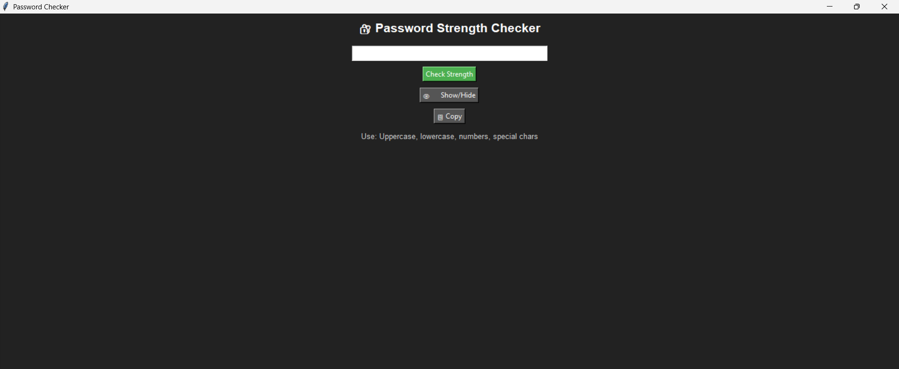

# Password Strength Checker

A simple Python GUI application to evaluate password strength.  
Built with **Tkinter** and **Regex**, this tool helps users create strong and secure passwords.

---

## Features
- **Password Strength Analysis:** Weak, Medium, Strong with a numeric score.  
- **Show/Hide Password:** Toggle visibility while typing.  
- **Copy Password:** Copy the entered password to clipboard easily.  
- **Password Hint:** Reminds users to use uppercase, lowercase, numbers, and special characters.  
- **Simple GUI:** Lightweight and beginner-friendly interface.

---

## Screenshots
 

---

## Installation
1. Make sure Python 3.x is installed on your system.
2. Clone this repository:
   ```bash
   git clone https://github.com/your-username/password-strength-checker.git

